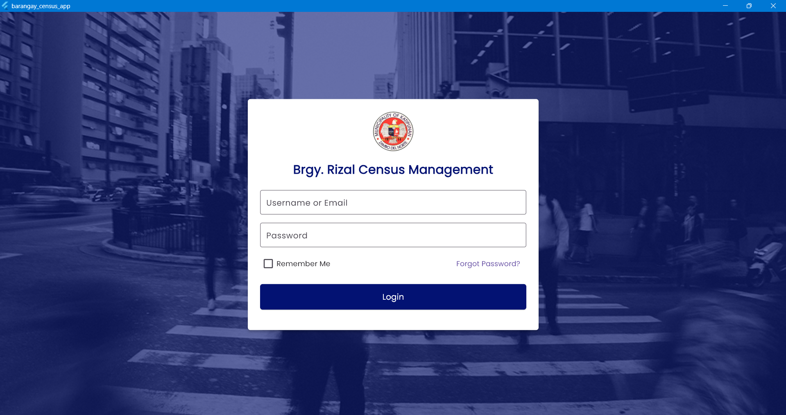
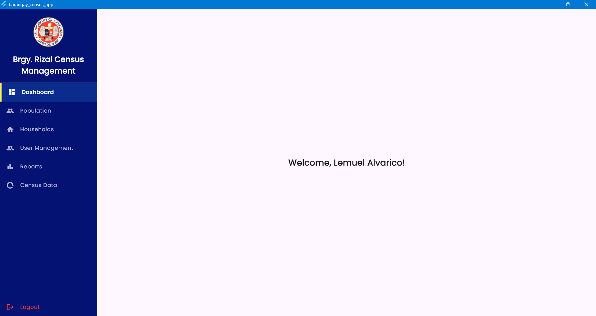

# Brgy. Rizal Census Management System

Dr. Rizal Census Management Sytsem with Analytics.

## Screenshots

### Login Page



### Home/Dashboard



## Prerequisites

- Flutter SDK
- MySQL Database
- Dart SDK

## Installation

1. Clone the repository

   ```bash
   git clone https://github.com/lemuelalvarico71-design/barangay_census/tree/census-v2.git

   ```

2. Change Dart SDK version in pubspec.yaml with your current dark SDK version:
   ```bash
   environment:
      sdk: ">=3.9.2 <4.0.0"
   ```
3. Install dependencies:
   ```bash
   flutter pub get
   ```
4. Configure database connection (see Database Setup below)
5. Run the application:
   ```bash
   flutter run
   ```

## Database Setup

### 1. Create Database

```sql
CREATE DATABASE barangay_census;
```

### 2. Create Users Table

```sql
CREATE TABLE `users` (
  `id` int(11) NOT NULL AUTO_INCREMENT,
  `fullname` varchar(100) NOT NULL,
  `email` varchar(100) NOT NULL,
  `username` varchar(50) NOT NULL,
  `password` varchar(100) NOT NULL,
  `role` enum('Admin','Staff','User') DEFAULT 'User',
  `created_at` timestamp NOT NULL DEFAULT current_timestamp(),
  PRIMARY KEY (`id`),
  UNIQUE KEY `username` (`username`),
  UNIQUE KEY `email` (`email`)
) ENGINE=InnoDB DEFAULT CHARSET=utf8mb4 COLLATE=utf8mb4_general_ci;
```

### 3. Configure Database Connection

Update `lib/config/db_config.dart`:

```dart
import 'package:mysql1/mysql1.dart';

class DatabaseConfig {
  static final settings = ConnectionSettings(
    host: 'localhost',
    port: 3306,
    user: 'root',
    password: 'your_password',
    db: 'barangay_census',
  );
}
```

### 4. Add Default Admin User

```sql
INSERT INTO `users` (`fullname`, `email`, `username`, `password`, `role`) VALUES
('Lemuel Alvarico', 'lemuel@gmail.com', 'lemuel', '123456', 'Admin');
```

## Default Login Credentials

- **Username:** lemuel
- **Password:** 123456
- **Role:** Admin
